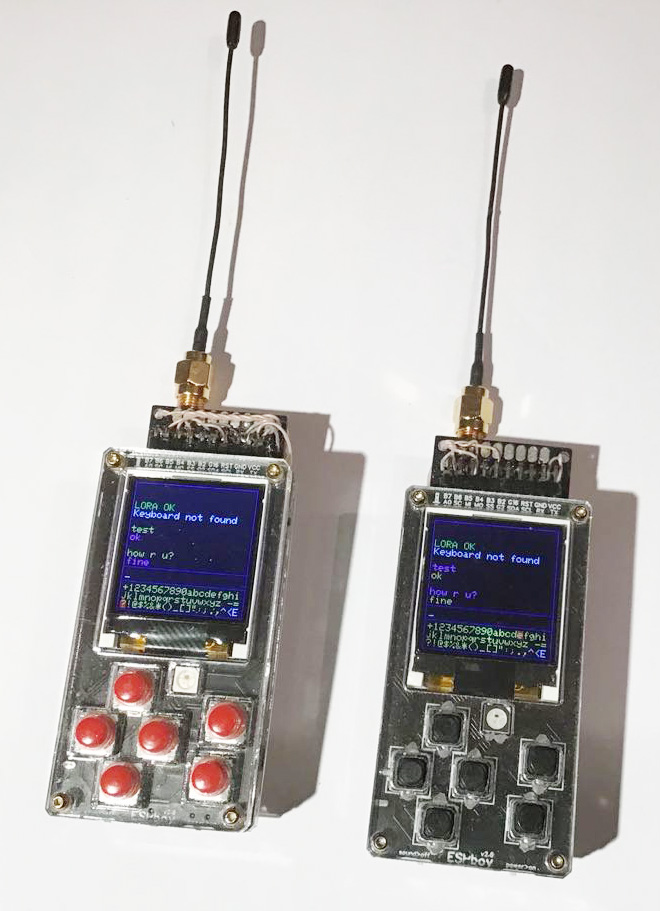
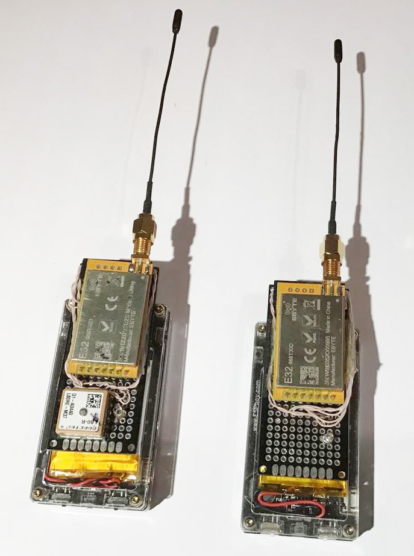
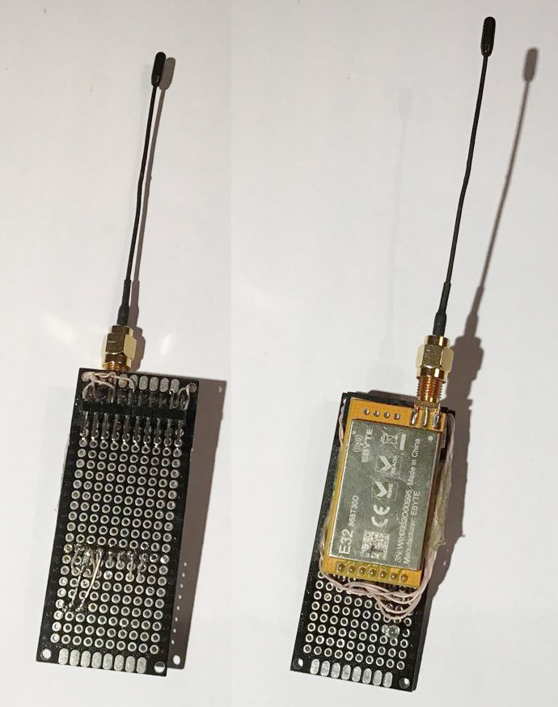
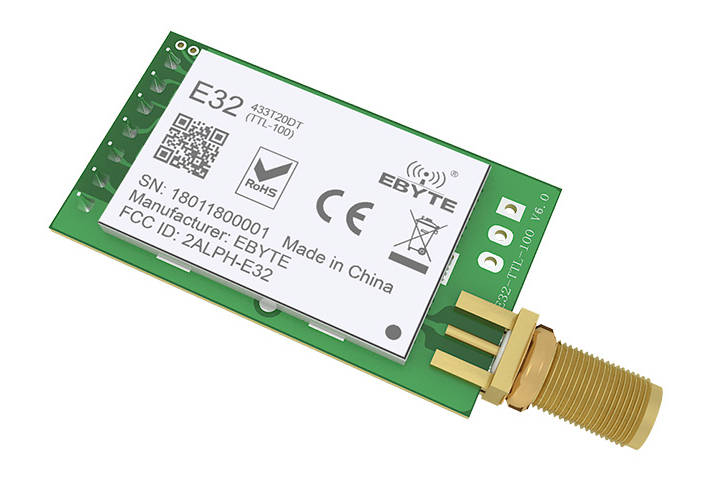

# ESPboy LORA messenger

[Demo video](https://www.youtube.com/watch?v=gTPbAHR1Q_A)

ESPboy LORA messenger based on EBYTE E32 LORA modules provides up to 8km encrypted chat. 
Almost absolute privacy ) 

You can buy this module ready-made or make it yourself.

## 1. Buy EBYTE E32 LORA module

[Here you can find lot of them](https://aliexpress.ru/item/32791508935.html?sku_id=63827064437&spm=a2g2w.productlist.0.0.53ee4d19KkH6VF)

Note:
- Select a module with the correct frequency range allowed in your country 433/868/915 MHz (see the module data sheet for the exact frequency range)
- Choose the module with the correct output power allowed in your country 100mW/1W (for the exact output power see the module's data sheet)
- You can communicate between modules with the same frequency

## 2. Buy and connect antenna with corresponded connector for the same frequency as your module (it's important to have correct antenna)

[For example here](https://www.aliexpress.com/store/group/Communication-Antenna/2798183_10000000863529.html?spm=a2g2w.detail.1000061.18.6d5a5c141aJGCI&_ga=2.178958308.1747976162.1633989151-433412991.1633989151)

Running without antenna your module could be damaged!

## 3. Do the connections

- LORA VCC -> ESPboy VCC
- LORA GND -> ESPboy GND
- LORA M0  -> ESPboy B5 (MCP23017 GPIO13)  
- LORA M1  -> ESPboy B6 (MCP23017 GPIO14) 
- LORA AUX -> ESPboy B7 (MCP23017 GPIO15)
- LORA RX  -> ESPboy SS (Slave Select) (D8) (GPIO15)
- LORA TX  -> ESPboy MI (MISO) (D6) (GPIO12)

## 3. Upload this firmware

NOTE: Before compilation, set Arduino IDE settings

-  Board:  ESP8266 WeMos D1 mini
-  CPU frequency: 160Mhz

## 4. Useful links

- [Buy ESPboy](https://www.tindie.com/products/23910/)
- [DIY ESPboy](https://easyeda.com/ESPboy)
- [Main Web site](https://www.espboy.com)
- [YouTube channel](https://www.youtube.com/c/ESPboy)
- [Community](https://community.espboy.com)
- [Discord chat](https://discord.gg/kXfDQpX)
- [Twitter](https://twitter.com/ESPboy_edu)
- [Software](https://github.com/ESPboy-edu)
- [Contact: espboy.edu@gmail.com](mailto:espboy.edu@gmail.com)

